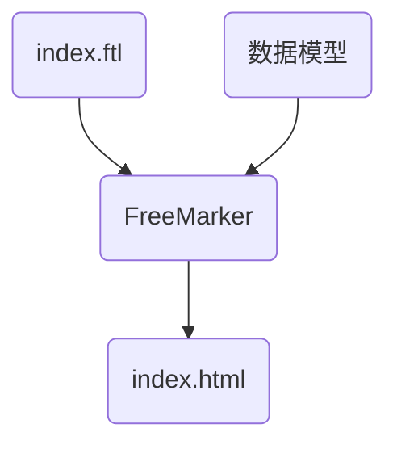

# FreeMarker Demo

> 官方文档：https://freemarker.apache.org/

## FreeMarker简介

官网介绍：Apache FreeMarker™ is a *template engine*: a Java library to generate text output (HTML web pages, e-mails, configuration files, source code, etc.) based on templates and changing data. Templates are written in the FreeMarker Template Language (FTL), which is a simple, specialized language (not a full-blown programming language like PHP). Usually, a general-purpose programming language (like Java) is used to prepare the data (issue database queries, do business calculations). Then, Apache FreeMarker displays that prepared data using templates. In the template you are focusing on how to present the data, and outside the template you are focusing on what data to present.


FreeMarker 是一款**模板引擎**： 即一种基于模板和要改变的数据， 并用来生成输出文本(HTML网页，电子邮件，配置文件，源代码等)的通用工具。 它不是面向最终用户的，而是一个**Java类库**，是一款程序员可以嵌入他们所开发产品的组件。模板编写为**FreeMarker Template Language (FTL)**。它是简单的，专用的语言，不是像PHP那样成熟的编程语言。 那就意味着要准备数据在真实编程语言中来显示，比如数据库查询和业务运算， 之后模板显示已经准备好的数据。在模板中，你可以专注于如何展现数据， 而在模板之外可以专注于要展示什么数据。 

FreeMarker架构图：


## FreeMarker基础

> 指令文档：https://freemarker.apache.org/docs/ref_directives.html

### 1、基础语法种类

  1、注释，即<#--  -->，介于其之间的内容会被freemarker忽略

```velocity
<#--我是一个freemarker注释-->
```

  2、插值（Interpolation）：即 **`${..}`** 部分,freemarker会用真实的值代替**`${..}`**

```velocity
Hello ${name}
```

  3、FTL指令：和HTML标记类似，名字前加#予以区分，Freemarker会解析标签中的表达式或逻辑。

```velocity
<# >FTL指令</#> 
```

  4、文本，仅文本信息，这些不是freemarker的注释、插值、FTL指令的内容会被freemarker忽略解析，直接输出内容。

```velocity
<#--freemarker中的普通文本-->
我是一个普通的文本
```

### 2、集合指令（List和Map）

List

```html
<#list stus as stu>
  <tr>
    <td>${stu_index+1}</td>
    <td>${stu.name}</td>
    <td>${stu.age}</td>
    <td>${stu.money}</td>
  </tr>
  </#list>
```

Map

```html
<h3>方式一：通过map['key-name'].property</h3><br/>
输出stu1的学生信息：<br/>
姓名：${stuMap['stu1'].name}<br/>
年龄：${stuMap['stu2'].age}<br/>
<br/>
<h3>方式二：通过map.key-name.property</h3><br/>
输出stu2的学生信息：<br/>
姓名：${stuMap.stu1.name}<br/>
年龄：${stuMap.stu2.age}<br/>

<#list stuMap?keys as key>
  <tr>
    <td>${key_index}</td>
    <td>${stuMap[key].name}</td>
    <td>${stuMap[key].age}</td>
    <td>${stuMap[key].money}</td>
  </tr>
  </#list>
```

### 3、if指令

​	 if 指令即判断指令，是常用的FTL指令，freemarker在解析时遇到if会进行判断，条件为真则输出if中间的内容，否则跳过内容不再输出。

指令格式：

```ftl
<#if ></if>
```

### 4、运算符

#### 4.1、算数运算符

FreeMarker表达式中完全支持算术运算,FreeMarker支持的算术运算符包括:

- 加法： `+`
- 减法： `-`
- 乘法： `*`
- 除法： `/`
- 求模 (求余)： `%`

模板代码

```html
<b>算数运算符</b>
<br/><br/>
    100+5 运算：  ${100 + 5 }<br/>
    100 - 5 * 5运算：${100 - 5 * 5}<br/>
    5 / 2运算：${5 / 2}<br/>
    12 % 10运算：${12 % 10}<br/>
<hr>
```

除了 + 运算以外，其他的运算只能和 number 数字类型的计算。

#### 4.2、比较运算符

- **`=`**或者**`==`**:判断两个值是否相等. 
- **`!=`**:判断两个值是否不等. 
- **`>`**或者**`gt`**:判断左边值是否大于右边值 
- **`>=`**或者**`gte`**:判断左边值是否大于等于右边值 
- **`<`**或者**`lt`**:判断左边值是否小于右边值 
- **`<=`**或者**`lte`**:判断左边值是否小于等于右边值 

📢注意：比较运算符注意

- **`=`**和**`!=`**可以用于字符串、数值和日期来比较是否相等
- **`=`**和**`!=`**两边必须是相同类型的值,否则会产生错误
- 字符串 **`"x"`** 、**`"x "`** 、**`"X"`**比较是不等的.因为FreeMarker是精确比较
- 其它的运行符可以作用于数字和日期,但不能作用于字符串
- 使用**`gt`**等字母运算符代替**`>`**会有更好的效果,因为 FreeMarker会把**`>`**解释成FTL标签的结束字符
- 可以使用括号来避免这种情况,如:**`<#if (x>y)>`**


#### 4.3、逻辑运算符

- 逻辑与:&& 
- 逻辑或:|| 
- 逻辑非:! 

逻辑运算符只能作用于布尔值,否则将产生错误 。


### 5、空值处理

#### 5.1、判断某变量是否存在使用 `??`

用法为：`variable??`,如果该变量存在,返回true,否则返回false 

例：为防止stus为空报错可以加上判断如下：

```velocity
    <#if stus??>
    <#list stus as stu>
    	......
    </#list>
    </#if>
```


#### 5.2、缺失变量默认值使用`!`

- 使用!要以指定一个默认值，当变量为空时显示默认值

	例：  `${name!''}`表示如果name为空显示空字符串。

- 如果是嵌套对象则建议使用（）括起来

	例： `${(stu.bestFriend.name)!''}`表示，如果stu或bestFriend或name为空默认显示空字符串。


### 6、内建函数

内建函数语法格式： **`变量+?+函数名称`**  

**1、和到某个集合的大小**

**`${集合名?size}`**

**2、日期格式化**

显示年月日: **`${today?date}`** 
显示时分秒：**`${today?time}`**   
显示日期+时间：**`${today?datetime}`**   
自定义格式化：  **`${today?string("yyyy年MM月")}`**

**3、内建函数`c`**

`model.addAttribute("point", 102920122);`

point是数字型，使用${point}会显示这个数字的值，每三位使用逗号分隔。

如果不想显示为每三位分隔的数字，可以使用c函数将数字型转成字符串输出

**`${point?c}`**

**4、将json字符串转成对象**

例子：其中用到了 assign标签，assign的作用是定义一个变量。

```velocity
<#assign text="{'bank':'工商银行','account':'10101920201920212'}" />
<#assign data=text?eval />
开户行：${data.bank}  账号：${data.account}
```


## 静态化测试

需求：使用Freemarker原生Api来生成静态内容



① 修改application.yml文件，添加实际的模板存放位置的配置信息

```yaml
spring:
  freemarker:
    # 制定模板文件的后缀名
    suffix: .ftl
    # 模板加载路径
    template-loader-path: classpath:/templates
```

② 测试

```java
import com.juzi.freemarker.model.Student;
import freemarker.template.Configuration;
import freemarker.template.Template;
import freemarker.template.TemplateException;
import org.junit.jupiter.api.Test;
import org.springframework.boot.test.context.SpringBootTest;

import javax.annotation.Resource;
import java.io.FileWriter;
import java.io.IOException;
import java.util.ArrayList;
import java.util.HashMap;
import java.util.List;
import java.util.Map;

@SpringBootTest
public class FreemarkerTest {

  @Resource
  private Configuration configuration;

  @Test
  public void testFreemarker() throws IOException, TemplateException {
    Template template = configuration.getTemplate("list-map.ftl");
    Map<String, Object> data = getData();
		// 实际存放路径
    String path = "xxx/student-info.html";
    template.process(data, new FileWriter(path));
  }

  public Map<String, Object> getData() {
    Map<String, Object> map = new HashMap<>();

    // list
    Student stu1 = new Student();
    stu1.setName("Tom");
    stu1.setAge(18);
    stu1.setMoney(200.0);

    Student stu2 = new Student("Jerry", 19, 250.0);
    List<Student> studentList = new ArrayList<>() {{
      add(stu1);
      add(stu2);
    }};
    map.put("stuList", studentList);

    // map
    Map<String, Student> studentMap = new HashMap<>() {{
      put("stu1", stu1);
      put("stu2", stu2);
    }};
    map.put("stuMap", studentMap);

    return map;
  }
}
```

