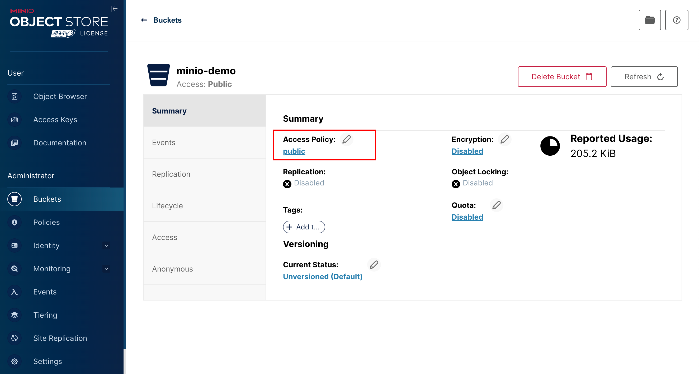
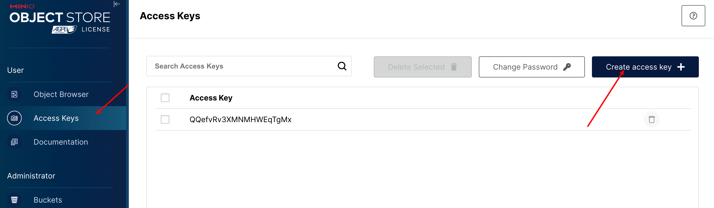
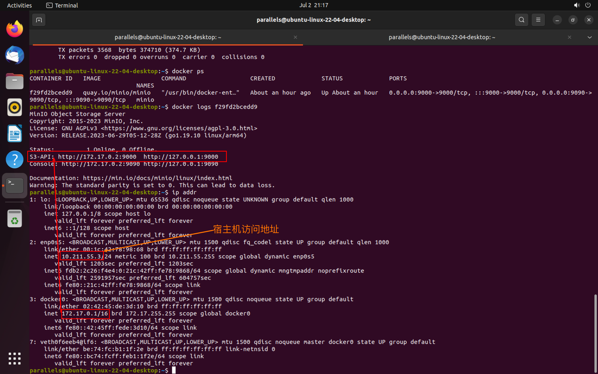

# MinIO 实战

> 官网：https://min.io/

## 简介

官网简介：MinIO is a high-performance, S3 compatible object store. It is built for
large scale AI/ML, data lake and database workloads. It runs on-prem and
on any cloud (public or private) and from the data center to the edge. MinIO
is software-defined and open source under GNU AGPL v3.

MinIO基于Apache License v2.0开源协议的对象存储服务，可以做为云存储的解决方案用来保存海量的图片，视频，文档。

由于采用Golang实现，服务端可以工作在Windows、Linux、OS X和FreeBSD上。配置简单，基本是复制可执行程序，单行命令可以运行起来。

MinIO兼容亚马逊S3云存储服务接口，非常适合于存储大容量非结构化的数据，例如图片、视频、日志文件、备份数据和容器/虚拟机镜像等，而一个对象文件可以是任意大小，从几kb到最大5T不等。

=> **S3 （ Simple Storage Service简单存储服务）**

基本概念

- bucket – 类比于文件系统的目录
- Object – 类比文件系统的文件
- Keys – 类比文件名

官网文档：http://docs.minio.org.cn/docs/


## 特点

1. 数据保护

	MinIO使用Minio Erasure Code（纠删码）来防止硬件故障。即便损坏一半以上的driver，但是仍然可以从中恢复

2. 高性能

	作为高性能对象存储，在标准硬件条件下它能达到55GB/s的读、35GB/s的写速率

3. 可扩容

	不同MinIO集群可以组成联邦，并形成一个全局的命名空间，并跨越多个数据中心

4. 丰富的SDK

	基于Minio轻量的特点，它得到类似Java、Python或Go等语言的sdk支持

5. dashboard操作界面

	面向用户友好的简单操作界面，非常方便的管理Bucket及里面的文件资源

6. 功能简单

7. 丰富的API

	支持文件资源的分享连接及分享链接的过期策略、存储桶操作、文件列表访问及文件上传下载的基本功能等

8. 文件变化主动通知

	存储桶（Bucket）如果发生改变,比如上传对象和删除对象，可以使用存储桶事件通知机制进行监控，并通过以下方式发布出去:AMQP、MQTT、Elasticsearch、Redis、NATS、MySQL、Kafka、Webhooks等


## Quick Start

### 1、安装

参考[官方文档](http://docs.minio.org.cn/docs/)，选择合适的操作系统安装

**Docker安装**：https://www.minio.org.cn/docs/minio/container/index.html#procedure

```sh
mkdir -p ~/minio/data

podman run \
	 -d \
   -p 9000:9000 \
   -p 9090:9090 \
   -v ~/minio/data:/data \
   -e "MINIO_ROOT_USER=ROOTNAME" \
   -e "MINIO_ROOT_PASSWORD=CHANGEME123" \
   quay.io/minio/minio server /data --console-address ":9090"
```

> 修改上述命令中的MINIO_ROOT_USER、MINIO_ROOT_PASSWORD

访问`http://IP:9000`，AK和SK在上述命令已指定

查看日志：

```sh
docker ps
```

```sh
docker logs <container-id>
```


### 2、使用

1）进入控制台，创建一个Bucket，同时设置访问权限为public




2）获取AccessKey



下载对应的json文件，获取对应的ak、sk


3）创建一个Maven/SpringBoot项目

pom.xml

```xml
<?xml version="1.0" encoding="UTF-8"?>
<project xmlns="http://maven.apache.org/POM/4.0.0"
         xmlns:xsi="http://www.w3.org/2001/XMLSchema-instance"
         xsi:schemaLocation="http://maven.apache.org/POM/4.0.0 http://maven.apache.org/xsd/maven-4.0.0.xsd">
  <modelVersion>4.0.0</modelVersion>

  <parent>
    <groupId>org.springframework.boot</groupId>
    <artifactId>spring-boot-starter-parent</artifactId>
    <version>2.7.12</version>
  </parent>

  <groupId>com.juzi</groupId>
  <artifactId>minio-demo</artifactId>
  <version>1.0-SNAPSHOT</version>

  <properties>
    <java.version>11</java.version>
    <maven.compiler.source>11</maven.compiler.source>
    <maven.compiler.target>11</maven.compiler.target>
    <minio.version>8.5.2</minio.version>
  </properties>

  <dependencies>
    <dependency>
      <groupId>io.minio</groupId>
      <artifactId>minio</artifactId>
      <version>${minio.version}</version>
    </dependency>
    <dependency>
      <groupId>org.springframework.boot</groupId>
      <artifactId>spring-boot-starter-test</artifactId>
    </dependency>
  </dependencies>

</project>
```

创建测试类，上传一张图片：

```java
package com.juzi.minio;

import io.minio.MinioClient;
import io.minio.PutObjectArgs;

import java.io.FileInputStream;

/**
 * @author codejuzi
 */
public class MinIOTest {
  public static void main(String[] args) {
    FileInputStream fileInputStream;
    try {

      fileInputStream = new FileInputStream("/Users/codejuzi/Pictures/Bg/code_bear.jpg");

      //1.创建minio链接客户端
      MinioClient minioClient = MinioClient.builder().credentials("QQefvRv3XMNMHWEqTgMx", "05Gxf0TSaxo83w28m6CN7ZQegWd9h3PkMIXnYxTh")
        .endpoint("http://10.211.55.3:9000").build();
      //2.上传
      PutObjectArgs putObjectArgs = PutObjectArgs.builder()
        // 文件名
        .object("code_bear.jpg")
        // 文件类型
        .contentType("image/jpeg")
        .bucket("minio-demo")
        // 文件流
        .stream(fileInputStream, fileInputStream.available(), -1)
        .build();
      minioClient.putObject(putObjectArgs);

      System.out.println("http://10.211.55.3:9000/minio-demo/code_bear.jpg");

    } catch (Exception ex) {
      ex.printStackTrace();
    }
  }
}
```

> 创建MinIO客户端时传入的凭证为上一步创建的AK和SK
>
> endpoint为minio启动日志中的S3-API指定的地址
>
> 
>
> 由于作者minio是在虚拟机上启动的，代码访问是在宿主机上进行的，因此使用的ens33地址

运行，控制台会输出访问地址，点击访问即可


## 封装MinIO-File-Starter

> 目的：方便文件操作

1）创建一个Maven/SpringBoot项目

pom.xml

```xml
<?xml version="1.0" encoding="UTF-8"?>
<project xmlns="http://maven.apache.org/POM/4.0.0"
         xmlns:xsi="http://www.w3.org/2001/XMLSchema-instance"
         xsi:schemaLocation="http://maven.apache.org/POM/4.0.0 http://maven.apache.org/xsd/maven-4.0.0.xsd">
  <modelVersion>4.0.0</modelVersion>

  <groupId>com.juzi</groupId>
  <artifactId>minio-file-starter</artifactId>
  <version>0.0.1</version>


  <properties>
    <java.version>11</java.version>
    <maven.compiler.source>11</maven.compiler.source>
    <maven.compiler.target>11</maven.compiler.target>
    <spring.boot.version>2.7.12</spring.boot.version>
    <minio.version>8.5.2</minio.version>
    <lombok.version>1.18.26</lombok.version>
  </properties>

  <dependencies>
    <dependency>
      <groupId>org.springframework.boot</groupId>
      <artifactId>spring-boot-starter</artifactId>
      <version>${spring.boot.version}</version>
    </dependency>

    <dependency>
      <groupId>org.springframework.boot</groupId>
      <artifactId>spring-boot-configuration-processor</artifactId>
      <version>${spring.boot.version}</version>
    </dependency>

    <dependency>
      <groupId>org.springframework.boot</groupId>
      <artifactId>spring-boot-starter-actuator</artifactId>
      <version>${spring.boot.version}</version>
    </dependency>
    
    <dependency>
      <groupId>io.minio</groupId>
      <artifactId>minio</artifactId>
      <version>${minio.version}</version>
    </dependency>

    <dependency>
      <groupId>org.projectlombok</groupId>
      <artifactId>lombok</artifactId>
      <version>${lombok.version}</version>
      <optional>true</optional>
    </dependency>

  </dependencies>

</project>
```


2）创建配置类

`MinIOConfigProperties.java`

```java
package com.juzi.file.config;

import lombok.Data;
import org.springframework.boot.context.properties.ConfigurationProperties;

import java.io.Serializable;

/**
 * minio配置项
 *
 * @author codejuzi
 */
@Data
@ConfigurationProperties(prefix = "minio")
public class MinIOConfigProperties implements Serializable {

  private static final long serialVersionUID = -5360946810187104229L;

  private String accessKey;
  private String secretKey;
  private String bucket;
  private String endPoint;
  private String readPath;

}

```


`MinIOConfig.java`

```java
package com.juzi.file.config;

import com.juzi.file.service.FileStorageService;
import io.minio.MinioClient;
import lombok.Data;
import org.springframework.boot.autoconfigure.condition.ConditionalOnClass;
import org.springframework.boot.context.properties.EnableConfigurationProperties;
import org.springframework.context.annotation.Bean;
import org.springframework.context.annotation.Configuration;

import javax.annotation.Resource;

/**
 * minio 配置
 *
 * @author codejuzi
 */
@Data
@Configuration
@EnableConfigurationProperties({MinIOConfigProperties.class})
@ConditionalOnClass({FileStorageService.class})
public class MinIOConfig {

  @Resource
  private MinIOConfigProperties minIOConfigProperties;

  /**
     * 构建minio客户端
     *
     * @return minio client
     */
  @Bean
  public MinioClient minioClient() {
    return MinioClient.builder()
      .credentials(minIOConfigProperties.getAccessKey(), minIOConfigProperties.getSecretKey())
      .endpoint(minIOConfigProperties.getEndPoint())
      .build();
  }
}

```


3）创建文件存储服务

`FileStorageService.java`

```java
package com.juzi.file.service;

import java.io.InputStream;

/**
 * 文件存储服务接口
 *
 * @author codejuzi
 */
public interface FileStorageService {

  /**
     * 上传文件
     *
     * @param prefix      文件名前缀
     * @param fileName    文件名
     * @param inputStream 文件流
     * @param type        文件类别
     * @return 文件全路径
     */
  String uploadFile(String prefix, String fileName, InputStream inputStream, String type);


  /**
     * 上传图片文件
     *
     * @param prefix      文件名前缀
     * @param fileName    文件名
     * @param inputStream 文件流
     * @return 文件全路径
     */
  String uploadImage(String prefix, String fileName, InputStream inputStream);

  /**
     * 上传HTML文件
     *
     * @param prefix      文件名前缀
     * @param fileName    文件名
     * @param inputStream 文件流
     * @return 文件全路径
     */
  String uploadHtml(String prefix, String fileName, InputStream inputStream);

  /**
     * 删除文件
     *
     * @param filePathUrl 文件全路径
     */
  void delete(String filePathUrl);

  /**
     * 下载文件
     *
     * @param filePathUrl 文件全路径
     * @return 文件流
     */
  InputStream downloadFile(String filePathUrl);

}

```


`FileStorageServiceImpl.java`

```java
package com.juzi.file.service.impl;

import com.juzi.file.config.MinIOConfig;
import com.juzi.file.config.MinIOConfigProperties;
import com.juzi.file.service.FileStorageService;
import io.minio.GetObjectArgs;
import io.minio.MinioClient;
import io.minio.PutObjectArgs;
import io.minio.RemoveObjectArgs;
import lombok.extern.slf4j.Slf4j;
import org.springframework.boot.context.properties.EnableConfigurationProperties;
import org.springframework.context.annotation.Import;

import javax.annotation.Resource;
import java.io.InputStream;
import java.text.SimpleDateFormat;
import java.util.Date;

/**
 * minio 操作文件实现类
 *
 * @author codejuzi
 */
@Slf4j
@EnableConfigurationProperties({MinIOConfigProperties.class})
@Import({MinIOConfig.class})
public class MinIOFileStorageService implements FileStorageService {

  @Resource
  private MinioClient minioClient;

  @Resource
  private MinIOConfigProperties minIOConfigProperties;

  private static final String SEPARATOR = "/";
  private static final String IMAGE_TYPE = "image/jpeg";
  private static final String HTML_TYPE = "text/html";

  private static final String DATE_FORMAT_PATTERN = "yyyy/MM/dd";

  @Override
  public String uploadFile(String prefix, String fileName, InputStream inputStream, String type) {
    String filePath = buildFilePath(prefix, fileName);

    try {
      PutObjectArgs putObjectArgs = PutObjectArgs.builder()
        .object(filePath)
        .contentType(type)
        .bucket(minIOConfigProperties.getBucket())
        .stream(inputStream, inputStream.available(), -1)
        .build();
      minioClient.putObject(putObjectArgs);
      return minIOConfigProperties.getReadPath()
        + SEPARATOR
        + minIOConfigProperties.getBucket()
        + SEPARATOR
        + filePath;
    } catch (Exception e) {
      log.error("minio put file error, ", e);
      throw new RuntimeException("upload file filed");
    }
  }

  @Override
  public String uploadImage(String prefix, String fileName, InputStream inputStream) {
    return uploadFile(prefix, fileName, inputStream, IMAGE_TYPE);
  }

  @Override
  public String uploadHtml(String prefix, String fileName, InputStream inputStream) {
    return uploadFile(prefix, fileName, inputStream, HTML_TYPE);
  }

  @Override
  public void delete(String filePathUrl) {
    String key = filePathUrl.replace(minIOConfigProperties.getEndPoint(), "");
    int index = key.indexOf(SEPARATOR);
    String bucket = key.substring(0, index);
    String filePath = key.substring(index + 1);

    // delete
    RemoveObjectArgs removeObjectArgs = RemoveObjectArgs.builder().bucket(bucket).object(filePath).build();
    try {
      minioClient.removeObject(removeObjectArgs);
    } catch (Exception e) {
      log.error("minio remove file error, pathUrl:{}", filePathUrl, e);
      throw new RuntimeException(e);
    }
  }

  @Override
  public InputStream downloadFile(String filePathUrl) {
    GetObjectArgs getObjectArgs = GetObjectArgs.builder()
      .bucket(minIOConfigProperties.getBucket())
      .object(filePathUrl)
      .build();
    try {
      return minioClient.getObject(getObjectArgs);
    } catch (Exception e) {
      log.error("minio download file error, ", e);
      throw new RuntimeException(e);
    }

  }

  /**
     * 构建文件路径
     *
     * @param dirPath  文件夹路径名
     * @param fileName 文件名 eg: yyyy/mm/dd/file.jpg
     * @return 文件路径
     */
  private String buildFilePath(String dirPath, String fileName) {
    StringBuilder stringBuilder = new StringBuilder(50);
    if (!dirPath.isEmpty()) {
      stringBuilder.append(SEPARATOR).append(dirPath);
    }
    SimpleDateFormat sdf = new SimpleDateFormat(DATE_FORMAT_PATTERN);
    String todayStr = sdf.format(new Date());
    stringBuilder.append(todayStr).append(SEPARATOR).append(fileName);
    return stringBuilder.toString();
  }
}

```


4）开启自动装配

创建`resource/META-INF/spring.factories`

```ini
org.springframework.boot.autoconfigure.EnableAutoConfiguration=\
  com.juzi.file.service.impl.MinIOFileStorageService
```


5）安装到本地Maven仓库，供其他模块或者项目使用

```sh
mvn clean install -DskipTests=true
```


6）改造上述minio-demo项目，使用minio-file-starter

引入依赖：

```xml
<dependency>
  <groupId>com.juzi</groupId>
  <artifactId>minio-file-starter</artifactId>
  <version>0.0.1</version>
</dependency>
```

增加配置：

```yaml
minio:
  access-key: QQefvRv3XMNMHWEqTgMx
  secret-key: 05Gxf0TSaxo83w28m6CN7ZQegWd9h3PkMIXnYxTh
  end-point: http://10.211.55.3:9000
  read-path: http://10.211.55.3:9000
  bucket: minio-demo
```

创建测试类，测试：

```java
package com.juzi.minio;

import com.juzi.file.service.FileStorageService;
import org.junit.jupiter.api.Test;
import org.springframework.boot.test.context.SpringBootTest;

import javax.annotation.Resource;
import java.io.FileInputStream;
import java.io.FileNotFoundException;

/**
 * @author codejuzi
 */
@SpringBootTest
public class MinioStaterTest {

  @Resource
  private FileStorageService fileStorageService;

  @Test
  public void testUpdateImgFile() {
    try {
      String imgPath = "/Users/codejuzi/Pictures/Bg/github-cover.jpg";
      FileInputStream fileInputStream = new FileInputStream(imgPath);
      String filePath = fileStorageService.uploadImage("", "github-cover", fileInputStream);
      System.out.println(filePath);
    } catch (FileNotFoundException e) {
      e.printStackTrace();
    }
  }
}

```

